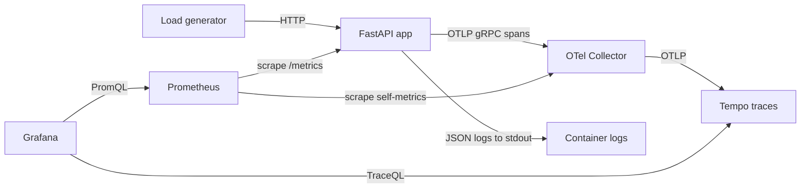
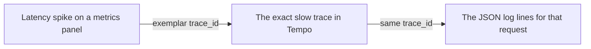

# observability-starter

**The three pillars for a Python service, wired and working** — OpenTelemetry tracing, Prometheus metrics, and trace-correlated structured logs on a real FastAPI app, with a docker-compose Grafana stack and provisioned dashboards.


Most "observability tutorials" show you one pillar in isolation and stop at `print("hello metrics")`. This is the opposite: a small service that is actually worth watching, with all three pillars turned on, exporting to a full local stack you bring up with one command. Copy the `app/telemetry/` package into your own project and you have logs, metrics and traces on day one.

---

## Why

The point of observability is not "collect telemetry". It is being able to answer *why is this request slow or broken?* without redeploying. That takes three signals that reference each other:

| Pillar | Answers | Cost model |
| --- | --- | --- |
| **Metrics** | *Is something wrong, and how bad?* Cheap aggregates over time — rates, error ratios, latency quantiles. | Constant cost, bounded by label cardinality. |
| **Traces** | *Where in the request did the time go?* One request, broken into spans across functions and services. | Per-request, usually sampled. |
| **Logs** | *What exactly happened at this step?* The detail line for one event, with full context. | Per-event, the most expensive at volume. |

You start at metrics (a dashboard alerts you), pivot to a trace (the latency panel's exemplar links to the exact slow request), then read the logs for that trace (they carry the same `trace_id`). This repo wires that pivot end to end: the latency histogram emits trace-id **exemplars**, and every log line carries `trace_id` + `span_id`.

### RED and USE, in four lines

- **RED** — for *request-driven* services, watch **R**ate, **E**rrors, **D**uration. This is the shape of the provided dashboard.
- **USE** — for *resources* like CPU, memory, disk, connection pools, watch **U**tilization, **S**aturation, **E**rrors.
- RED tells you the service is unhappy; USE tells you which resource to blame. The in-progress-requests gauge here is a saturation signal — the bridge between the two.

---

## Architecture



Metrics use a **pull** model — Prometheus scrapes `/metrics` on the app. Traces use a **push** model — the app ships spans over OTLP to the collector, which batches and forwards them to Tempo. Logs go to stdout as JSON, where your platform's log agent picks them up. Grafana reads Prometheus and Tempo and links between them.



---

## Quickstart

```bash
git clone https://github.com/AleBrito124356/observability-starter
cd observability-starter

cp .env.example .env          # every value has a working default

# Bring up app + collector + prometheus + tempo + grafana
docker compose -f deploy/docker-compose.yml up --build -d

# Drive traffic so the dashboards have something to show
python -m pip install httpx
python load/generate.py --duration 120 --concurrency 20
```

Then open:

| URL | What |
| --- | --- |
| http://localhost:3000 | Grafana — dashboard **"observability-starter - RED overview"** (anonymous admin, no login) |
| http://localhost:9090 | Prometheus — query `http_requests_total` directly |
| http://localhost:8000/docs | The instrumented service's OpenAPI UI |
| http://localhost:8000/metrics | Raw Prometheus exposition |

There are **no secrets** in this project and nothing to sign up for. The `.env` exists only for tuning behaviour.

### Run the app on its own, without Docker

```bash
python -m venv .venv && source .venv/bin/activate   # Windows: .venv\Scripts\activate
pip install -r requirements.txt

# No collector running? Build spans without exporting them:
OTEL_TRACES_EXPORTER=none uvicorn app.main:app --reload
```

---

## Usage

Exercise the endpoints and watch the signals move:

```bash
curl -s localhost:8000/api/orders/ORD-1001?outcome=ok | jq
# {"order_id":"ORD-1001","status":"confirmed","total_usd":142.87,"db_latency_ms":63.4}

curl -si localhost:8000/api/orders/ORD-1002?outcome=fail | head -1
# HTTP/1.1 503 Service Unavailable      <- becomes a 5xx on the error panel

curl -s localhost:8000/metrics | grep -E '^http_request'
# http_requests_total{method="GET",path="/api/orders/{order_id}",status_code="200"} 41.0
# http_request_duration_seconds_bucket{le="0.1",method="GET",path="/api/orders/{order_id}",status_code="200"} 33.0
# http_requests_in_progress{method="GET",path="/api/orders/{order_id}"} 0.0
```

Note the `path` label is the **route template** `/api/orders/{order_id}`, not the raw URL — that keeps metric cardinality bounded no matter how many order ids you throw at it.

A log line looks like this (one JSON object per line, correlated to its trace):

```json
{"event": "order.processed", "order_id": "ORD-1001", "total_usd": 142.87,
 "db_latency_ms": 63.4, "request_id": "f002c93dbbd341bd8093d0289aa2d487",
 "level": "info", "timestamp": "2026-07-19T14:38:02.682182Z",
 "trace_id": "e0f6d1ff36449ad5577cd0f890d3e7ce", "span_id": "5db5a2b066638f8a"}
```

### The dashboard, panel by panel

| Panel | Query intent | Read it as |
| --- | --- | --- |
| **Request rate by route** | `sum by (path) (rate(http_requests_total[...]))` | The **R** in RED — traffic shape per endpoint. |
| **Requests by status code** | rate split by `status_code`, 5xx in red | The **E** in RED — watch the red band grow. |
| **Error rate** | `5xx / total`, as a percent | A single number to alert on. |
| **Requests in progress** | `sum(http_requests_in_progress)` | Saturation — concurrency in flight right now. |
| **Latency p50 / p95 / p99** | `histogram_quantile(...)` over the bucket rate | The **D** in RED — and the p95 line carries exemplars. |
| **Orders processed by outcome** | `rate(orders_processed_total)` by `status` | The custom **business** metric, not just HTTP. |
| **Request latency heatmap** | bucket rate by `le` | The full latency distribution over time. |

Click a purple exemplar dot on the latency panel to jump straight to that trace in Tempo. In the trace you will see the FastAPI server span, the manual `process_order` span with its `order.id` and `order.total_usd` attributes, and the nested `db.query` span — the whole request, decomposed.

### Run the tests

```bash
pip install -r requirements-dev.txt
pytest
# tests/test_logging.py ...      log lines carry trace_id and span_id
# tests/test_metrics.py .....    series registered, exposed, cardinality bounded
# tests/test_tracing.py ....     endpoints emit server + manual spans, errors recorded
# 12 passed
```

---

## Copy the telemetry into your own app

Everything reusable lives in `app/telemetry/`. It has no dependency on the demo endpoints — the only thing to rename is the business counter `ORDERS_PROCESSED` in `metrics.py`. Drop the folder into your project and wire it up:

```python
from prometheus_client import make_asgi_app
from app.telemetry.logging import RequestIDMiddleware, configure_logging
from app.telemetry.metrics import PrometheusMiddleware
from app.telemetry.tracing import configure_tracing

configure_logging(settings)              # JSON logs + trace correlation
app.add_middleware(RequestIDMiddleware)  # request id -> logs, span, response header
app.add_middleware(PrometheusMiddleware) # RED metrics for every route
app.mount("/metrics", make_asgi_app())   # Prometheus scrape endpoint
configure_tracing(app, settings)         # OTLP export + auto-instrumentation
```

The middleware are deliberately **pure ASGI**, not `BaseHTTPMiddleware`, so they run in the same task as your endpoints and preserve the OpenTelemetry context — that is what makes the trace id available for exemplars and log correlation. Add manual spans around the work that matters, exactly as `app/services.py` does around `process_order`.

## An honest note on overhead and sampling

- **Metrics** are essentially free — a few atomic increments and a histogram observation per request. The real cost is *cardinality*: keep label values bounded (route templates, not raw paths; status codes, not messages). This repo does that for you.
- **Tracing** is not free. Span creation, attribute serialization and OTLP export cost CPU and bandwidth that scale with request volume. In development, `TRACE_SAMPLE_RATIO=1.0` keeps every trace. In production, lower it (`0.05`–`0.1` is common) — the `ParentBased` sampler here keeps a whole trace or drops it as a unit, so you never get half-recorded traces. Tail-based sampling in the collector is the next step when you want to always keep errors and slow requests.
- **Logs** are the most expensive signal at scale. JSON structured logs are worth it for the queryability, but keep them at `INFO` in production and lean on traces for per-step detail rather than logging inside every function.
- The middleware resolves the route template by matching against the app's routes on each request — an `O(routes)` cost that is negligible for typical apps but worth knowing about if you have thousands of routes.

The default here optimizes for *seeing everything while you learn*. Turn the knobs down before you ship.

---

## Project structure

```text
observability-starter/
├── app/
│   ├── main.py                 # FastAPI app factory + endpoints
│   ├── config.py               # env-driven settings (pydantic-settings)
│   ├── services.py             # business logic with manual spans + business metric
│   └── telemetry/              # <- the reusable package
│       ├── tracing.py          #    OTel SDK, OTLP exporter, auto-instrumentation
│       ├── metrics.py          #    Prometheus RED metrics + ASGI middleware
│       └── logging.py          #    structlog JSON + trace correlation + request-id
├── deploy/
│   ├── docker-compose.yml      # app + collector + prometheus + tempo + grafana
│   ├── Dockerfile              # the app image
│   ├── otel-collector-config.yaml
│   ├── prometheus.yml          # scrape config (exemplar storage enabled)
│   ├── tempo.yaml              # single-binary Tempo, local storage
│   └── grafana/provisioning/   # datasources + dashboard, provisioned on boot
├── load/generate.py            # asyncio + httpx load generator
├── tests/                      # metric registration, spans, log/trace correlation
├── requirements.txt
└── requirements-dev.txt
```

---

## Related projects

Part of a set of production-shaped starters:

- **[docker-compose-stacks](https://github.com/AleBrito124356/docker-compose-stacks)** — copy-paste Docker Compose stacks for a dev machine; the observability stack here follows those conventions.
- **[ml-deployment-patterns](https://github.com/AleBrito124356/ml-deployment-patterns)** — serve sklearn/ONNX with FastAPI, versioning and drift; the exact kind of service you would bolt this telemetry onto.
- **[fastapi-production-template](https://github.com/AleBrito124356/fastapi-production-template)** — async SQLAlchemy, JWT, Redis and CI in a FastAPI starter, ready for this package to drop in.
- **[llm-gateway](https://github.com/AleBrito124356/llm-gateway)** — an OpenAI-compatible gateway with caching, routing and cost accounting, where per-request tracing earns its keep.

---

## License

MIT © 2026 Alejandro Brito. See [LICENSE](LICENSE).
